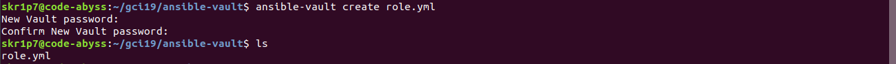
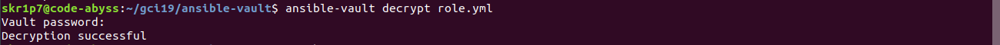
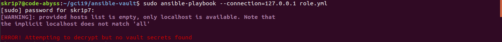
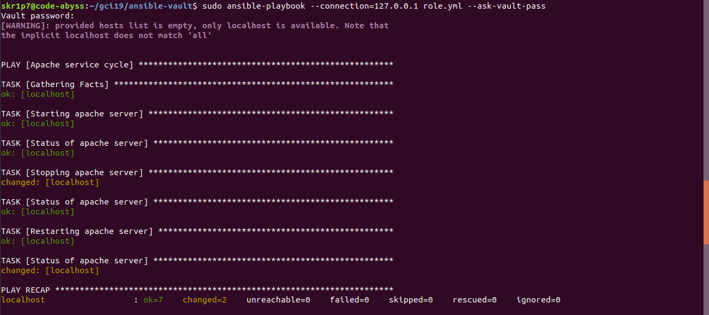

# Ansible playbook to demonstrate usage of Ansible Vault

## Requirements

### Prerequisites 

To run this playbook, user needs to have Ansible installed.

For Ubuntu/Debian:
From your control node, use the following command to include PPA in your list of sources >

```bash
$ sudo apt-add-repository ppa:ansible/ansible
```
Refresh the system's package index in order to successfully add the PPA to the sources

```bash
$ sudo apt install ansible
``` 

For Fedora Workstation >

```bash
$ dnf update
$ dnf install ansible
```

### Usage

Clone the GitHub repository using the following command :

```bash
$ git clone https://github.com/skr1p7/ansibles-vault.git
```

Navigate into the directory by using the following command :
```bash
$ cd ansibles-vault
```

To run the playbook, use the following command 
[NOTE: The playbook is configured to be used in localhost]

```bash
$ sudo ansible-playbook --connection=127.0.0.1 role.yml --ask-vault-pass
```

# How to encrypt a playbook with Ansible vault?

### To begin with the ```ansible-vault``` functionality, firstly we need to create an Ansible role, write the following command in your terminal:

```bash
$ ansible-vault create role.yml
New Vault password: <add your password here>
Confirm New Vault password: <confirm your password>
```
Here's what it looks like:


### Let's try to view the contents of our playbook, write the following command in your terminal:
```bash
$ cat role.yml
```

This would most likely throw a lot of gibberish (AES256 hashes to be brutally honest) as the output


### In order to Ansible Vault let us make the file read/editable, let's decrypt the playbook using the command:

```bash
$ ansible-vault decrypt role.yml 
Vault password: <password used in encryption>
Decryption successful
```


### So now we know how to encrypt, decrypt and decrypt to edit our playbook, what is we run this playbook? Using the following command in your terminal,  let's try running the playbook

```bash
$ ansible-playbook --connection=127.0.0.0 role.yml
```
As expected, this would throw an error ( which is meaningful) once again which says:
> ERROR! Attempting to decrypt but no vault secrets found


### To be able to run this playbook, we need to run the playbook with a few more arguments, use the following command:

```bash
$ ansible-playbook --connection=127.0.0.1 role.yml --ask-vault-pass
Vault password: <vault password to encrypt>
```

The output must look like this:
